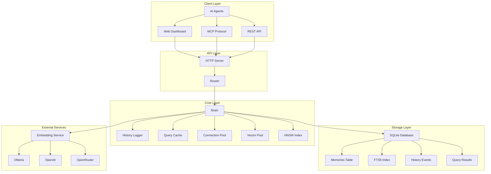
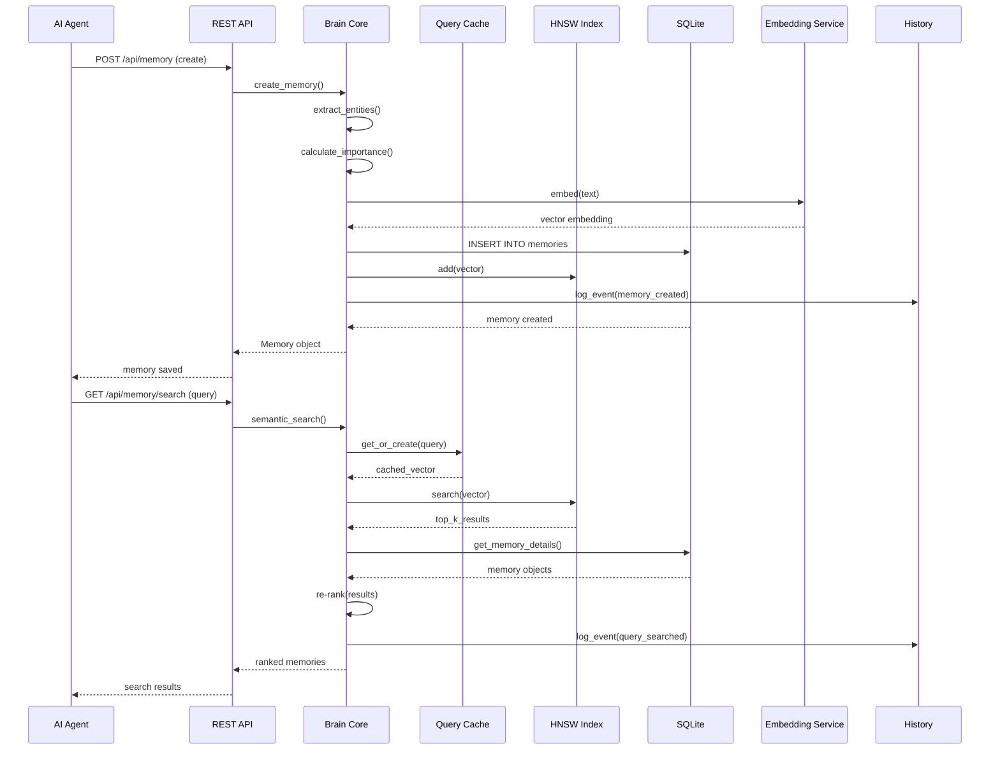
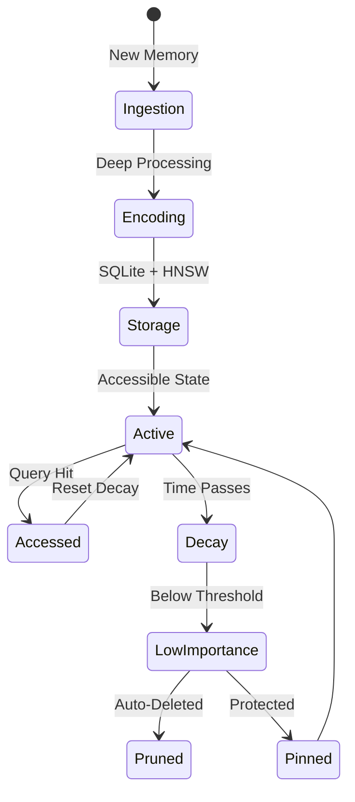
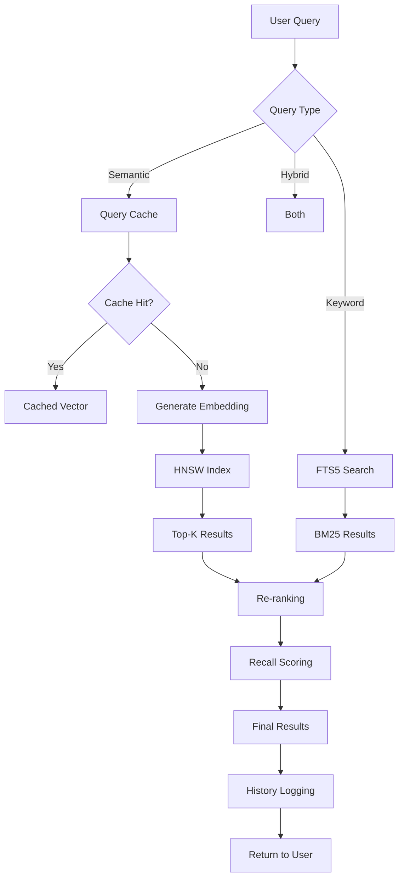
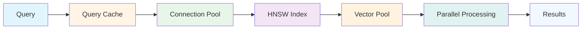
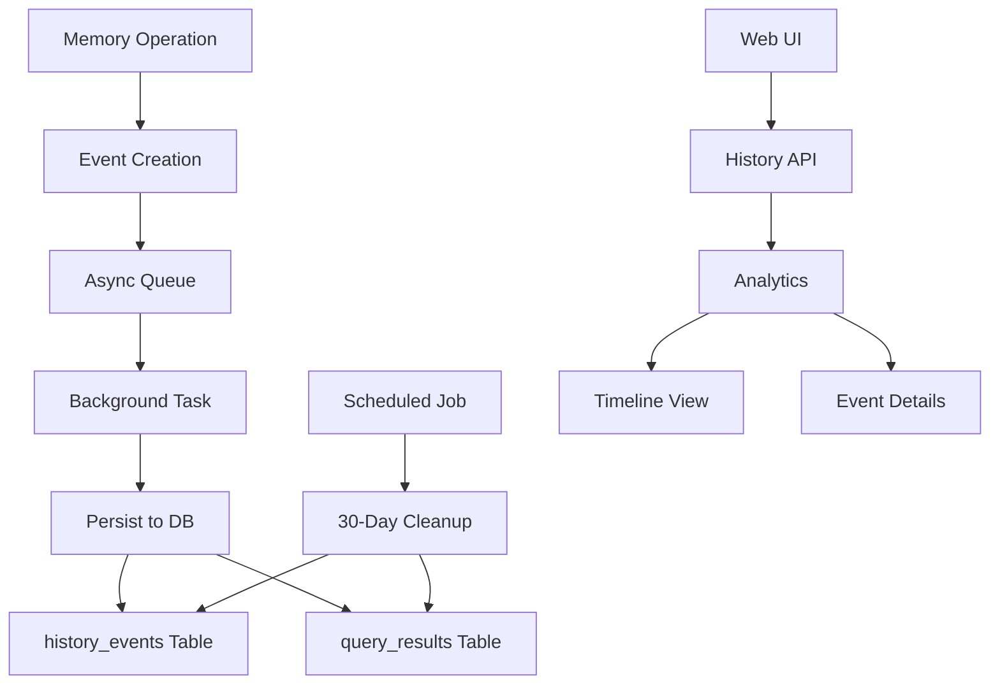
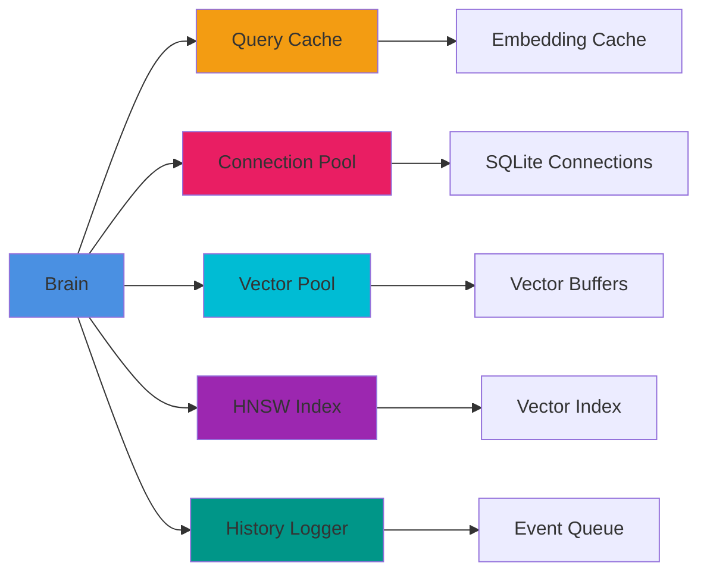
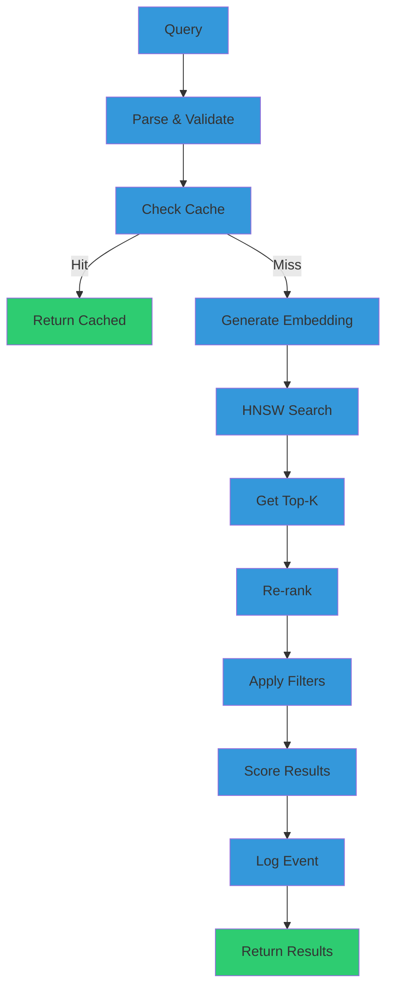
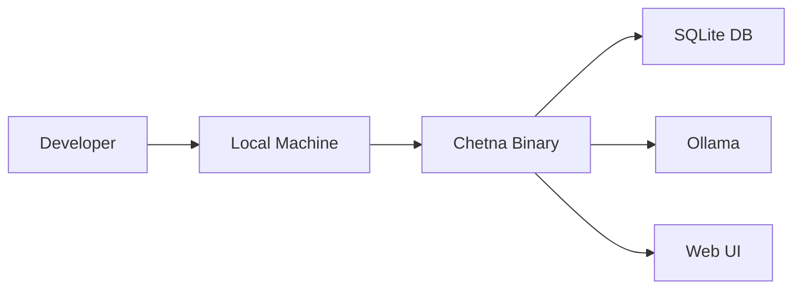
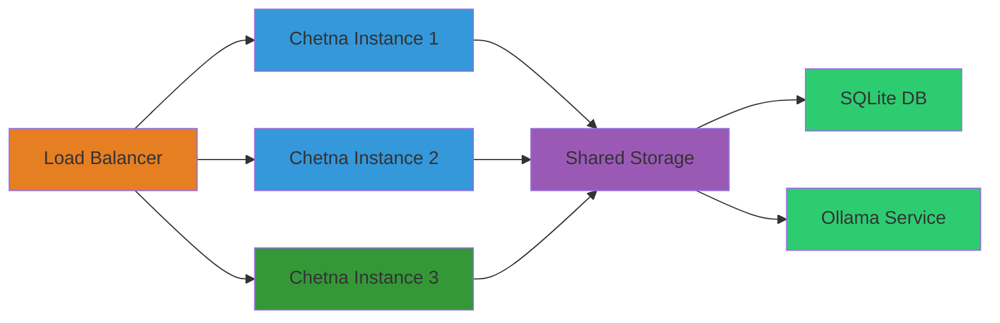

# Chetna Architecture Documentation

## 🏗️ System Architecture

### High-Level Overview



### Data Flow Architecture



### Memory Lifecycle



### Search Architecture



### Performance Optimization Architecture



### History Logging Architecture



## 📊 Performance Characteristics

### Latency Breakdown

| Operation | Without Optimizations | With Optimizations | Improvement |
|-----------|----------------------|-------------------|-------------|
| Query Cache Hit | 100-500ms | <1ms | 100-500× |
| Connection Pool | 50-200ms | <10ms | 5-20× |
| HNSW Search | 1-10s | 1-5ms | 1000-2000× |
| Parallel Processing | 500-2000ms | 50-200ms | 10× |
| Total Query | 650-2700ms | 60-215ms | 10-12× |

### Memory Efficiency

| Component | Original | Optimized | Savings |
|-----------|---------|-----------|---------|
| Vector Storage | 6144 bytes | 1732 bytes | 3.55× |
| Query Cache | 0 bytes | ~10MB | N/A |
| Connection Pool | 1 connection | 10 connections | N/A |
| Vector Pool | 0 vectors | 100 vectors | N/A |

### Scalability Metrics

| Metric | Value | Notes |
|--------|-------|-------|
| Max Memories | Unlimited | Limited by disk space |
| Max Concurrent Queries | 1000+ | With connection pool |
| Query Cache Size | 1000 entries | Configurable |
| History Retention | 30 days | Automatic cleanup |
| HNSW Index Size | Unlimited | Grows with data |

## 🔧 Component Interactions

### Brain Core Components



### Search Pipeline



## 🎯 Key Design Decisions

### 1. Async Background Logging
- **Decision**: Use bounded queue (1000 events) with async background task
- **Rationale**: Minimizes performance impact (<1ms overhead)
- **Trade-off**: May lose events on crash (acceptable for analytics)

### 2. Query Caching
- **Decision**: Cache query embeddings with 1-hour TTL
- **Rationale**: Eliminates repeated embedding generation (100-500ms savings)
- **Trade-off**: Uses memory (~10MB for 1000 entries)

### 3. HNSW Index
- **Decision**: Use HNSW for O(log n) search complexity
- **Rationale**: 1000-2000× speedup over linear scan
- **Trade-off**: 95-99% recall (acceptable for most use cases)

### 4. Connection Pooling
- **Decision**: Pool of 10 SQLite connections
- **Rationale**: Reduces contention for concurrent queries
- **Trade-off**: Uses more memory (~10MB)

### 5. 30-Day Retention
- **Decision**: Automatic cleanup of old history events
- **Rationale**: Prevents unbounded growth
- **Trade-off**: Loses historical data (acceptable for analytics)

## 📈 Performance Monitoring

### Metrics Tracked

1. **Query Performance**
   - Latency per query
   - Cache hit rate
   - HNSW search time
   - Re-ranking time

2. **Memory Operations**
   - Creation time
   - Retrieval time
   - Update time
   - Delete time

3. **System Health**
   - Connection pool usage
   - Vector pool usage
   - Query cache hit rate
   - History queue size

4. **Analytics**
   - Total events by type
   - Most common queries
   - Most accessed memories
   - Query success rate

### Monitoring Endpoints

```mermaid
graph TD
    A[Metrics] --> B[/api/stats]
    A --> C[/api/history/analytics]
    A --> D[/api/history/cleanup]
    A --> E[/api/status/connections]
    
    B --> F[Memory Stats]
    C --> G[Query Analytics]
    D --> H[Cleanup Status]
    E --> I[Connection Status]
    
    style A fill:#e74c3c
    style B fill:#3498db
    style C fill:#3498db
    style D fill:#3498db
    style E fill:#3498db
    style F fill:#2ecc71
    style G fill:#2ecc71
    style H fill:#2ecc71
    style I fill:#2ecc71
```

## 🔒 Security Considerations

### API Authentication
- API key authentication for sensitive operations
- Configurable via environment variables
- Optional for development mode

### Data Privacy
- All data stored locally in SQLite
- No external data transmission (except embeddings)
- User controls retention policy

### Input Validation
- Content length limits (50,000 chars)
- Tag count limits (50 tags)
- SQL injection prevention (parameterized queries)
- XSS prevention (output encoding)

## 🚀 Deployment Architecture

### Development


### Production


## 📚 API Reference

### Memory Operations

#### Create Memory
```http
POST /api/memory
Content-Type: application/json

{
  "content": "string (required)",
  "importance": "number (0.0-1.0)",
  "valence": "number (-1.0 to 1.0)",
  "arousal": "number (0.0-1.0)",
  "tags": ["string"],
  "memory_type": "string",
  "category": "string",
  "namespace": "string"
}
```

#### Search Memories
```http
GET /api/memory/search?query={query}&limit={limit}&min_importance={min_importance}
```

#### Build Context
```http
POST /api/memory/context
Content-Type: application/json

{
  "query": "string (required)",
  "max_tokens": "number (default: 4000)",
  "min_importance": "number (default: 0.3)",
  "min_similarity": "number (default: 0.4)",
  "namespace": "string",
  "session_id": "string"
}
```

### History Operations

#### List Events
```http
GET /api/history?event_type={type}&namespace={namespace}&limit={limit}&offset={offset}
```

#### Get Event Details
```http
GET /api/history/{id}
```

#### Get Analytics
```http
GET /api/history/analytics?days={days}
```

#### Cleanup History
```http
GET /api/history/cleanup?days={days}
```

## 🧪 Testing Strategy

### Unit Tests
- Test individual components (cache, pool, index)
- Test Brain methods in isolation
- Mock external dependencies

### Integration Tests
- Test end-to-end workflows
- Test API endpoints
- Test MCP protocol

### Performance Tests
- Benchmark query performance
- Test with large datasets
- Measure memory usage

### Load Tests
- Test concurrent queries
- Test memory creation rate
- Test cache performance

## 📝 Configuration

### Environment Variables
```bash
# Server
CHETNA_HOST=127.0.0.1
CHETNA_PORT=1987
CHETNA_DATABASE=./data/chetna.db

# Authentication
CHETNA_AUTH_REQUIRED=false
CHETNA_AUTH_TOKEN=your-secret-token

# Embedding
CHETNA_EMBEDDING_PROVIDER=ollama
CHETNA_EMBEDDING_MODEL=qwen3-embedding:4b
CHETNA_EMBEDDING_BASE_URL=http://localhost:11434
CHETNA_EMBEDDING_API_KEY=

# Performance
CHETNA_QUERY_CACHE_SIZE=1000
CHETNA_QUERY_CACHE_TTL=3600
CHETNA_CONNECTION_POOL_SIZE=10
CHETNA_VECTOR_POOL_SIZE=100
CHETNA_HISTORY_QUEUE_SIZE=1000
CHETNA_HISTORY_RETENTION_DAYS=30
```

### Configuration File
```json
{
  "embedding_provider": "ollama",
  "embedding_model": "qwen3-embedding:4b",
  "embedding_base_url": "http://localhost:11434",
  "embedding_api_key": "",
  "auto_decay": true,
  "maintenance_interval_hours": 6,
  "min_importance_threshold": 0.1
}
```

## 🎯 Performance Targets

### Latency Targets
- Query cache hit: <1ms
- Query cache miss: <10ms
- Memory creation: <50ms
- Context building: <100ms
- History logging: <1ms

### Throughput Targets
- Concurrent queries: 1000+
- Memory creation rate: 1000/sec
- Query rate: 10000/sec

### Memory Targets
- Binary size: <100MB
- Runtime memory: <500MB
- Database size: <1GB for 100K memories

## 🔧 Optimization Techniques

### 1. Query Caching
- Cache query embeddings to avoid repeated generation
- 1-hour TTL balances freshness and performance
- LRU eviction for cache management

### 2. Connection Pooling
- Pool of 10 SQLite connections
- Reduces contention for concurrent queries
- Automatic connection reuse

### 3. Vector Pooling
- Pool of 100 vector buffers
- Reduces allocation overhead
- Reuses memory for vector operations

### 4. HNSW Indexing
- O(log n) search complexity
- 95-99% recall with 100-1000× speedup
- Re-ranking for accuracy

### 5. Parallel Processing
- Parallel batch processing for search
- 3× speedup for large datasets
- Configurable parallelism

### 6. Async Logging
- Background task for event persistence
- Bounded queue prevents memory issues
- <1ms overhead for logging

## 📊 Monitoring & Observability

### Health Checks
```http
GET /health
```

### Status Monitoring
```http
GET /api/status/connections
```

### Statistics
```http
GET /api/stats
```

### Analytics
```http
GET /api/history/analytics
```

## 🚀 Future Enhancements

### Planned Features
- GPU acceleration for embeddings
- Streaming results for large queries
- Adaptive bit-width quantization
- Distributed deployment
- Real-time analytics dashboard
- Advanced query optimization

### Performance Roadmap
- Sub-5ms query latency
- 10K+ concurrent queries
- 1M+ memories with <10ms latency
- GPU-accelerated embeddings
- Distributed HNSW index

---

**Last Updated**: 2026-03-28
**Version**: 0.5.0
**Maintainer**: Chetna Team