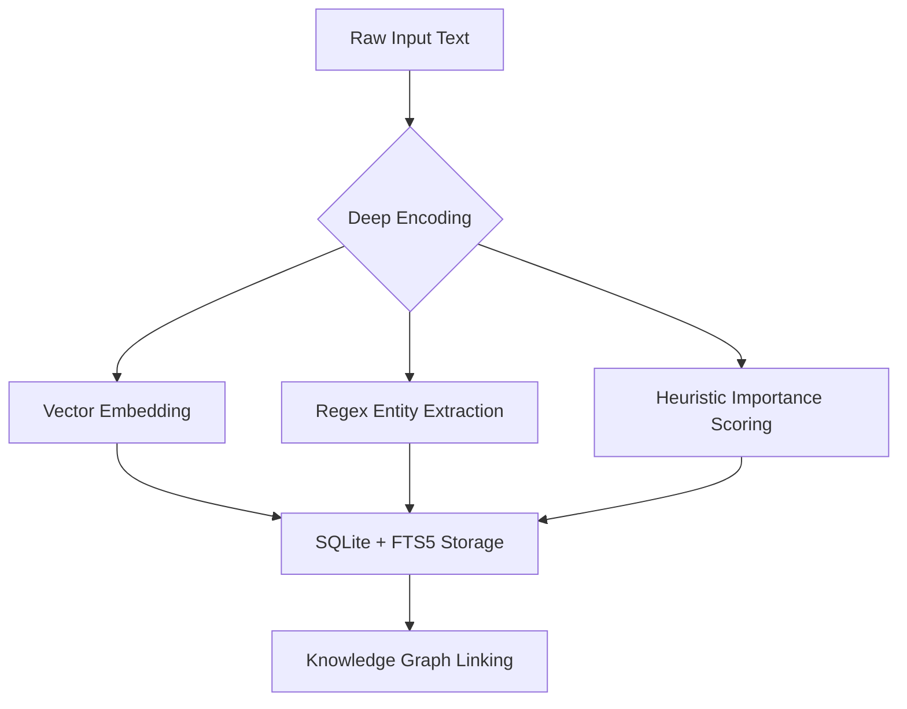
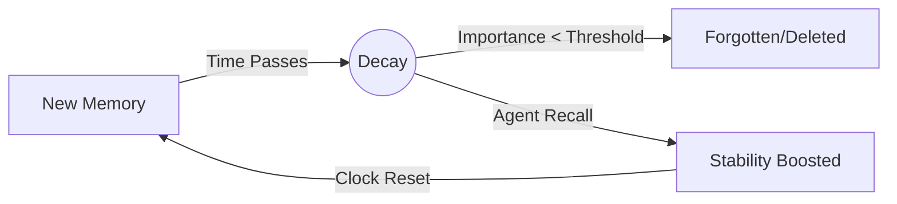
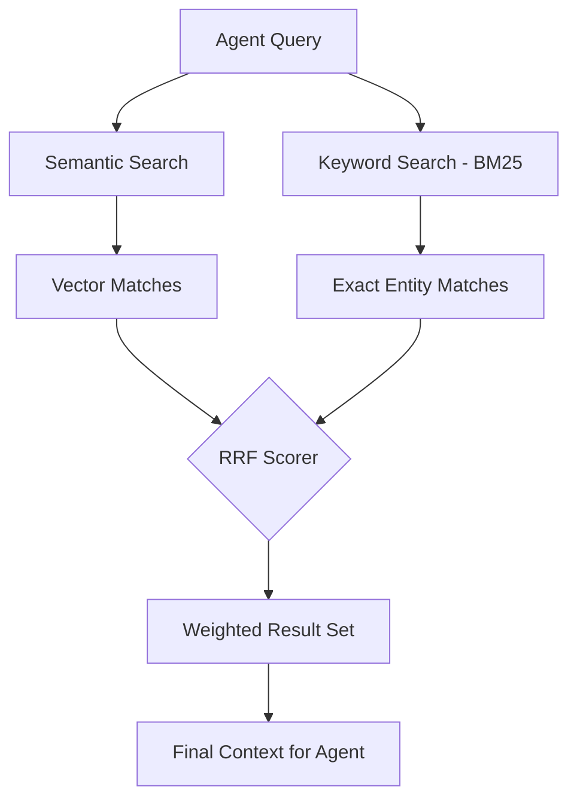

# 🧠 Chetna: Long-Term Memory for AI Agents

**Chetna** (Sanskrit for *awareness*) is a high-performance, standalone **Long-Term Memory as a Service (LTMS)**. It gives your AI agents a persistent brain that remembers facts, preferences, and context across sessions—so they never have "context amnesia" again.

Designed for developers and researchers, Chetna turns a simple vector database into a smart relational engine that learns and evolves.

---

## 🚀 How Chetna Works: The Digital Brain

Chetna isn't just a database; it's a cognitive layer that mimics the human brain's memory lifecycle.

### 1. Memory Ingestion & Encoding
When you save a memory, Chetna doesn't just store text. it performs **Deep Encoding**:
- **Semantic Vectoring:** Generates high-dimensional embeddings (via Ollama/OpenAI).
- **Entity Extraction:** Automatically identifies IPs, file paths, UUIDs, and Git hashes.
- **Initial Importance:** Heuristically scores how "critical" a memory is based on content.



### 2. Biological Decay & Stability (Ebbinghaus 3.0)
Like a human brain, Chetna "forgets" noise but protects vital information.
- **The Forgetting Curve:** Memories decay exponentially over time.
- **Active Recall Reset:** Every time an agent *explicitly* retrieves a memory by ID, its **Stability** increases and its "forgetting clock" resets to zero.
- **Stability Boost:** Frequently accessed memories become "permanent" (decay slower).



### 3. Retrieval: Hybrid Search (RRF)
Chetna uses **Reciprocal Rank Fusion** to ensure that "exact" technical matches (like an error code) and "vague" semantic matches (like a concept) are both found.



---

## 🧬 The Memory Lifecycle: A Concrete Example

**Day 1: Storage**
An agent stores: *"The user's server password is 'Apple123' and resides at /etc/config/secret."*
1. **Chetna** generates a vector for "password" and "server."
2. **Chetna** extracts `/etc/config/secret` as a searchable path entity.
3. **Chetna** assigns high importance because it contains "password."

**Day 10: Natural Decay**
The memory hasn't been accessed. Its importance score has naturally dropped from **0.90** to **0.65** based on the Ebbinghaus curve.

**Day 15: Active Recall**
The agent asks: *"Where is the server secret stored?"*
1. **Chetna** finds the memory via semantic search.
2. The agent retrieves the full memory by ID to use the password.
3. **Recall Event:** The memory's `access_count` increments, its `last_accessed` updates to **Now**, and its importance resets to **0.95**. It is now much harder to forget.

---

## ✨ Key Features
- 🧩 **Persistent Memory:** Store facts once, retrieve them forever.
- 🔍 **Hybrid Search (RRF):** Concept-based search + 100% accurate entity matching.
- 📉 **Spaced Repetition:** Smart decay ensures your context window isn't filled with old junk.
- 🔗 **Protocol Ready (MCP):** Native support for Claude Desktop, Windsurf, and Cursor.

---

## 🛠️ Quick Start

```bash
# Clone and Install
git clone https://github.com/vineetkishore01/Chetna.git
cd Chetna
./install.sh

# Visit Dashboard
# http://localhost:1987
```

---
*Built with ❤️ for the future of autonomous agents.*
