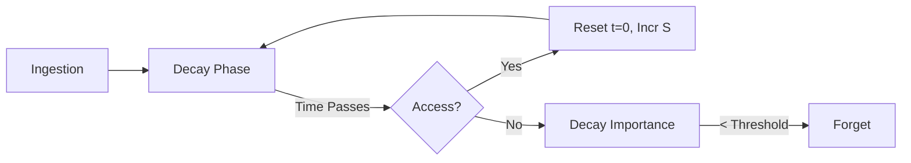

# Chetna Technical Specification

Chetna is an advanced Long-Term Memory System (LTMS) that implements a **Cognitive Relational Architecture**.

## Architecture Overview

### 1. Hybrid Search Engine
Chetna implements **Reciprocal Rank Fusion (RRF)** to combine two distinct search methodologies:
- **Lexical Search (BM25):** Utilizes SQLite FTS5 to match technical strings (UUIDs, Git hashes, Paths) with 100% accuracy.
- **Semantic Search (Vector):** Utilizes cosine similarity on text embeddings to find memories with similar conceptual meaning.

**RRF Scoring:**
`Final_Score = Σ (1 / (k + rank_i))` where `k` is a constant (default 60).
High-importance memories (pinned or manually scored > 0.8) receive a **relevance boost** in the final sorting to ensure critical rules outrank transient facts.

### 2. Biological Decay System (Ebbinghaus 3.0)
Chetna mimics human memory retention through a persistent stability model:
- **Base Formula:** `Importance_new = Importance_old * exp(-t / S)`
- **Stability (S):** Calculated based on `memory_type` base stability (e.g., Facts = 168h, Rules = 240h) multiplied by the **Active Recall Boost**.
- **Active Recall Boost:** `1.0 + ln(access_count)`.
- **Spaced Repetition Reset:** Unlike simple decay, `t` (time) is calculated as hours since **`last_accessed`**. Every explicit recall resets the curve, effectively "refreshing" the memory in the agent's long-term storage.

### 3. Knowledge Graph Integration
Instead of independent vectors, memories are linked via a **Directed Graph**:
- **Chunking:** Large documents are split into overlapping chunks, each linked to a parent via a `PartOf` relationship.
- **Relationship Manager:** An asynchronous worker maintains `memory_relationships` using a dedicated SQLite table to track causal and structural links.

### 4. Technical Entity Extraction
An internal regex-based pipeline automatically identifies and indexes the following entities during ingestion:
- **IPv4 Addresses**
- **Git Hashes (Full & Short)**
- **File Paths**
- **UUIDs**

## Data Model

### Memory Struct
| Field | Type | Description |
|-------|------|-------------|
| `id` | UUID | Primary Key |
| `namespace` | String | Application partition |
| `content` | String | Raw text |
| `entities` | String | Space-separated indexed entities |
| `importance` | Float | Current recall weight (0-1) |
| `access_count`| Integer | Number of explicit recall events |
| `last_accessed`| Timestamp | Last time memory was reset |
| `is_pinned` | Bool | Prevents auto-decay |

### Relationship Struct
| Field | Type | Description |
|-------|------|-------------|
| `source_id` | UUID | From memory |
| `target_id` | UUID | To memory |
| `relationship_type` | Enum | e.g., `part_of`, `contradicts` |
| `strength` | Float | Connection weight |
